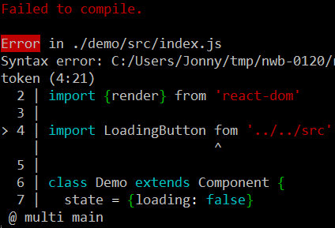
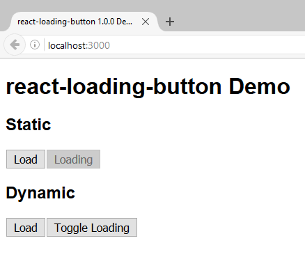
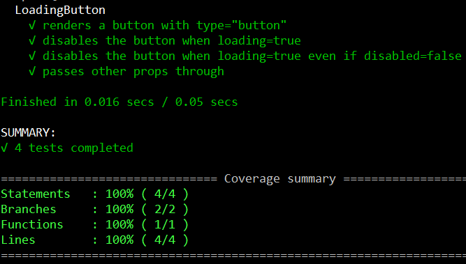
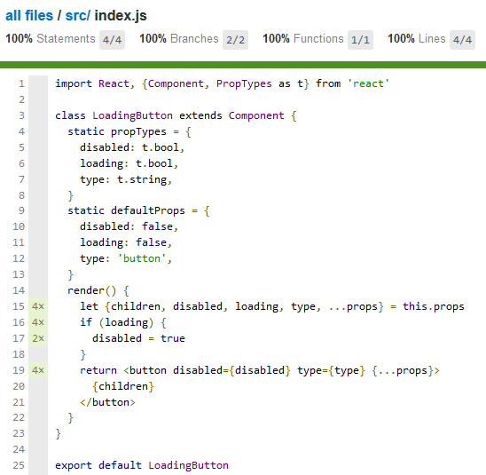
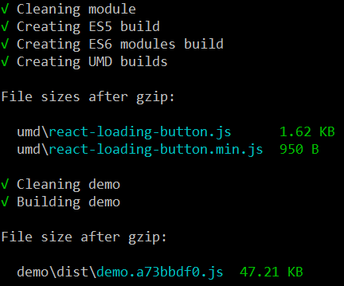

# Creating and Publishing React Components and Libraries with nwb

nwb supports development of React components and libraries which will be published to npm.

> **Prerequisite:** nwb must be installed globally (we're using version 0.12 in this guide):
>
> ```
> npm install -g nwb
> ```

- [Getting Started](#getting-started)
  - [Build Configuration Questions](#build-configuration-questions)
    - [ECMAScript 6 (ES6) Modules Build](#ecmascript-6-es6-modules-build)
    - [Universal Module Definition (UMD) Build](#universal-module-definition-umd-build)
- [Project Layout](#project-layout)
- [`npm run` Scripts](#npm-run-scripts)
- [Running the Demo App](#running-the-demo-app)
- [Testing](#testing)
  - [Code Coverage Reporting](#code-coverage-reporting)
  - [Continous Integration (CI) Testing](#continous-integration-ci-testing)
- [Building and Publishing](#building-and-publishing)
  - [Preparing for Publishing](#building)
  - [Publishing to npm](#publishing-to-npm)
- [Libraries](#libraries)
- [Build Configuration](#build-configuration)
  - [Config File](#config-file)
    - [UMD Externals](#umd-externals)
  - [Feature Toggles](#feature-toggles)
    - [`--no-demo`](#-no-demo)
    - [`--no-proptypes`](#-no-proptypes)

To walk you though the process, we're going to implement a simple `LoadingButton` component, which renders a `<button>` and implements the following requirements:

1. The button should take a `loading` prop, representing whichever action it controls being in progress (e.g. loading some data or submitting a form).
2. The button should be `disabled` when loading, to avoid the double-submission problem.
3. The button should default to `type="button"` instead of `<button>`'s usual `type="submit"`, which can be a surprising default.

## Creating a New React Component

Use the `nwb new` command to create a new React component project:

```
nwb new react-component react-loading-button
```

You'll be asked a few questions about your project's build configuration.

> **Note:** If you want to skip these questions, you can pass an `-f` or `--force` flag to accept the default configuration, or just keep bashing `Enter` to accept the defaults.
>
> If you want to skip *reading* about these questions, continue on to [Project Layout](#project-layout).

### Build Configuration Questions

nwb will always create an ES5 build for your project in `lib/`, which is the primary way it will be used when installed via npm, with default `package.json` `main` config pointing to `lib/index.js`.

Configuration questions are asked about *additional* builds

#### ECMAScript 6 (ES6) Modules Build

```
Creating a react-component project...
? Do you want to create an ES6 modules build? (Y/n)
```

An ES6 modules build retains use of ES6 `import` and `export` statements in your code but transpiles everything else to ES5.

Module bundlers like [Rollup](http://rollupjs.org/) and [Webpack 2](https://webpack.github.io/) can use this build to determine if code was imported but never used and eliminate it from the final bundle.

It's enabled by default, so we can just hit `Enter` to accept the default:

```
? Do you want to create an ES6 modules build? Yes
```

> **Note:** nwb will create an ES6 modules build in `es/` when we build the project later.
>
>It will also add `"module"` and `"jsnext:main"` configuration to `package.json`, for use by ES6 module bundlers.

#### Universal Module Definition (UMD) Build

```
? Do you want to create a UMD build? (y/N)
```

A [UMD](https://github.com/umdjs/umd#umd-universal-module-definition) build will let people use your component via a global variable by dropping it into a `<script>` tag - this makes it easier to try without any build tooling in an HTML file, and in tools like [JS Bin](http://jsbin.com/) and [CodePen](https://codepen.io/).

Since nwb will handle the details of creating this for us and [npmcdn](https://npmcdn.com) will allow people to grab the UMD build once published to npm, let's type `y` and hit `Enter`:

```
? Do you want to create a UMD build? Yes
? Which global variable name should the UMD build set?
```

We also need to provide the global variable name for the UMD build to set.

The convention in the React community seems to be a TitleCase version of your component or library's name, so let's go with `ReactLoadingButton`.

```
? Which global variable name should the UMD build set? ReactLoadingButton
```

> **Note:** nwb will create development `react-loading-button.js` and production `react-loading-button.min.js` UMD builds in `umd/` when we build the project later.

## Project Layout

The following directory structure will be created, with `react` and `react-dom` dependencies installed from npm into `node_modules/`:

```
react-loading-button/
  .gitignore
  .travis.yml
  CONTRIBUTING.md
  nwb.config.js
  package.json
  README.md
  demo/
    src/
      index.js
  node_modules/
  src/
    index.js
  tests/
    .eslintrc
    index-test.js
```

 `cd` into the project directory and we can get started on our example component:

```sh
cd react-loading-button/
```

> **Note:** You can use the `npm init` command instead if you want to create a project in the current directory.

## `npm run` Scripts

`package.json` is configured with `"scripts"` we can use with `npm run` while developing the project.

Command | Description |
--- | ---
`npm start` | start a development server for the demo app
`npm test` | run tests
`npm run test:coverage` | run tests and produce a code coverage report in `coverage/`
`npm run test:watch` | start a test server and re-run tests on every change
`npm run build` | prepare for publishing to npm
`npm run clean` | delete built resources

The initial project is set up so you can sucessfully run each of these commands and get some meaningful output, albeit for a component which does nothing more than render a welcome message.

## Running the Demo App

The project skeleton includes a demo app in `demo/src/index.js`.

> **Note:** If you don't need the demo app, you can safely delete the `demo/` directory.

Running `npm start` will start a development server for the demo app. Every time you make a change to the demo app or the component, it will refresh the current compilation status.


If there are any errors, they will be displayed in both the console and the browser, so you're unlikely to miss them while developing.

Console Error | Browser Error
:---: | :---:
 | 

Developing components against a hot-reloading app provides a quick feedback loop.

If you're into README Driven Development, it also provides a place to play with your component's API before you've built anything, and tinker with it live as you implement.

Let's start by imagining how we'll use our `LoadingButton` component in the demo app:

> **Note:** This Demo component is implemented as an ES6 class extending React's `Component` class, but also using some [experimental language features](http://babeljs.io/docs/plugins/transform-class-properties/) which are part of Babel's [stage 2 preset](http://babeljs.io/docs/plugins/preset-stage-2/), which is enabled by default when using nwb.
>
> Don't sweat the details of these if you're not familiar with them; the most important thing for this guide is the `render()` method.

```js
import React, {Component} from 'react'
import {render} from 'react-dom'

import LoadingButton from '../../src'

class Demo extends Component {
  state = {loading: false}

  handleToggleLoading = () => {
    this.setState({loading: !this.state.loading})
  }

  render() {
    return <div>
      <h1>react-loading-button Demo</h1>

      <h2>Static</h2>
      <LoadingButton>Load</LoadingButton>
      <LoadingButton loading>Loading</LoadingButton>

      <h2>Dynamic</h2>
      <LoadingButton loading={this.state.loading}>
        {this.state.loading ? 'Loading' : 'Load'}
      </LoadingButton>
      <button type="button" onClick={this.handleToggleLoading}>
        Toggle Loading
      </button>
    </div>
  }
}

render(<Demo/>, document.querySelector('#demo'))
```

Once your component is developed, the demo app falls back to its primary purpose of creating a demo you can deploy when publishing your code *without* having to build and publish separately, as component builds and demo bundles are built from the same source at the same time.

Here's an example implementation of the `LoadingButton` component:

```js
import React, {Component, PropTypes as t} from 'react'

class LoadingButton extends Component {
  static propTypes = {
    disabled: t.bool,
    loading: t.bool,
    type: t.string,
  }
  static defaultProps = {
    disabled: false,
    loading: false,
    type: 'button',
  }
  render() {
    let {children, disabled, loading, type, ...props} = this.props
    if (loading) {
      disabled = true
    }
    return <button disabled={disabled} type={type} {...props}>
      {children}
    </button>
  }
}

export default LoadingButton
```



## Testing

nwb provides a default testing setup which uses Karma to run tests written with Mocha and Expect in the headless PhantomJS browser.

> The [Testing documentation](/docs/Testing.md) provides a more in-depth overview of what the nwb's default testing setup allows you to do (and how to configure things to your liking if you want to), but we'll stick to editing the initial test provided in the React component project skeleton, in `tests/index-test.js`.

`npm run test:watch` automatically re-runs tests on every change to provide a quick feedback loop while developing, whether you're writing tests up-front, in parallel with implementation or after the fact.

If you're into Test Driven Development, it will give you the flow you want as you write breaking tests followed by implementations which satisfy them.

The following example tests were implemented after the `LoadingButton` component was written, adding one `it()` block at a time and tweaking each test based on feedback from re-runs - for example, I wasn't sure how a `disabled={true}` prop would be represented in the resulting HTML, so I used `.toContain('')` to see what would happen.

> **Note 1:** Testing against static HTML output is a brittle way to assert what your components are returning from their `render()` methods, but it's handy for our demonstration purposes.

> **Note 2:** We're importing the [expect](https://github.com/mjackson/expect/) library below, but it's not included in `package.json` - nwb handles the expect dependency for you so you can get started with testing without having to make a decision. Other assertion and spy libraries are available :)

```js
import expect from 'expect'
import React from 'react'
import {renderToStaticMarkup as render} from 'react-dom/server'

import LoadingButton from 'src/'

describe('LoadingButton', () => {
  it('renders a button with type="button"', () => {
    expect(render(<LoadingButton>Test</LoadingButton>))
      .toContain('<button type="button">Test</button>')
  })
  it('disables the button when loading=true', () => {
    expect(render(<LoadingButton loading>Test</LoadingButton>))
      .toContain('<button disabled="" type="button">Test</button>')
  })
  it('disables the button when loading=true even if disabled=false', () => {
    expect(render(<LoadingButton disabled={false} loading>Test</LoadingButton>))
      .toContain('<button disabled="" type="button">Test</button>')
  })
  it('passes other props through', () => {
    expect(render(<LoadingButton className="test">Test</LoadingButton>))
      .toContain('<button type="button" class="test">Test</button>')
  })
})
```

### Code Coverage Reporting

Once your tests are working, you can generate a code coverage report by running `npm run test:coverage`:



Code coverage percentages on their own are fairly meaningless, but running coverage also produces an HTML report in `coverage/html/` showing coverage statistics for each file and annotating your code to show which pieces were and weren't touched during a test run.



This HTML report is handy for finding out what your tests *aren't* covering, and deciding which uncovered areas you'd feel more comfortable having some tests for.

### Continous Integration (CI) Testing

If you use [GitHub](https://github.com/) for your project's source code hosting, it's preconfigured for running tests on [Travis CI](https://travis-ci.org/) and posting code coverage results to [coveralls](https://coveralls.io/) and [codecov.io](https://codecov.io/) after successful test runs.

If you log in to Travis CI and enable it for your GitHub project, your tests will be run on every subsequent commit and automatically run against Pull Requests.

## Building and Publishing

nwb provides a default setup which keeps your source code repository free from distracting built resources (which can also be confusing for potential contributors) and makes your code useable as part of a standard Node.js development setup, by module bundlers and directly in the browser via `<script>` tag.

### Preparing for Publishing

`npm run build` will prepare the component for publishing, creating:

- An ES5 build in `lib/`
- An ES6 modules build in `es/` (enabled by default / without configuration)
- UMD development and production builds in `umd/` (if configuration is provided)

The ES5 build preserves CommonJS interop using the [`add-module-exports`](https://github.com/59naga/babel-plugin-add-module-exports) plugin, to avoid people using your npm packages via CommonJS `require()` having to tag a `.default` onto every `require()` call.

Any `propTypes` declared by ES6 class components or stateless function components will be wrapped with an `if (process.env.NODE_ENV !== 'production')` environment check by default, so they'll be automatically stripped from the production build of apps which use them.

By default nwb will also create a production build of the demo React app in `demo/dist/`, ready for deployment to wherever you want to host the demo (e.g. [Surge](http://surge.sh/) for simple deployment, [GitHub Pages](https://pages.github.com/) for more involved deployment tied in with source control). The demo is configured so it can be served from any directory, so you shouldn't need to configure anything no matter where you're hosting it.



`.gitignore` is configured to ignore these build directories to avoid/prevent checking built resources into source control, since npm acts as the canonical source for published, versioned builds and [npmcdn](https://npmcdn.com) makes it easy to provide access to the UMD build.

For example, if you were to publish this example project to npm as `react-loading-button`,the latest version of its UMD build would be available from `https://npmcdn.com/react-loading-button/umd/react-loading-button.js` without having to configure anything.

### Publishing to npm

Once you've built your project, it's ready for publishing to npm using whatever your preferred process for doing that is, with the simplest being manually running `publish`:

```
npm publish
```

`package.json` is preconfigured with a [`"files"` whitelist](https://docs.npmjs.com/files/package.json#files) which will only include `lib/`, `es/` and `umd/` directories in the npm package, in addition to the usual npm metadata like `package.json` and `README.md`

## Libraries

We've demonstrated using nwb to develop and publish a single reusable React component, but the same tooling also applies to developing component libraries (such as [React Bootstrap](http://react-bootstrap.github.io/)) and other React libraries (such as [React Router](https://github.com/reactjs/react-router)).

The main difference with libraries is that the entry point (`src/index.js` by default when using nwb) usually imports and re-exports everything the library provides, for users performing top-level imports or using the UMD build.

## Build Configuration

### Config File

You can use [npm build configuration](/docs/Configuration.md#npm-build-configuration) in `nwb.config.js` to tweak your project's build.

#### UMD Externals

The React component template uses [`npm.umd.externals` config](/docs/Configuration.md#externals-object) to make UMD builds use React via a global `React` variable rather than bundling it.

If you have other dependencies users will need to make available globally to use your UMD build, you will need to add suitable configuration for them.

e.g. if your component uses React Router, you'll also need to map the 'react-router' import to the global variable exported by React Router's own UMD build:

```js
module.exports = {
  npm: {
    umd: {
      global: 'ReactSomComponent',
      externals: {
        'react': 'React',
        'react-router': 'ReactRouter'
      }
    }
  }
}
```

### Feature Toggles

Pass flags when running the build to toggle certain features off.

> Add feature toggle flags to the `"build"` script in `package.json` if you always want to use them.

#### `--no-demo`

Disables building the demo app.

Use this if you want to develop against the demo app using nwb's development server, but have your own setup for demonstrating your component or library.

> If you don't need the demo app at all, you can delete `demo/`.

#### `--no-proptypes`

Disables `propTypes` wrapping/stripping.

Use this if your component or library needs to use `propTypes` at runtime (e.g. for prop masking), or you think its users might need them.

> You can also pass flags to the `npm run build` command if you just want to try them out.
>
> You need to pass a `--` argument to indicate all additional arguments should be passed to the command itself, for example:
>
> ```
> npm run build -- --no-demo --no-proptypes
> ```
